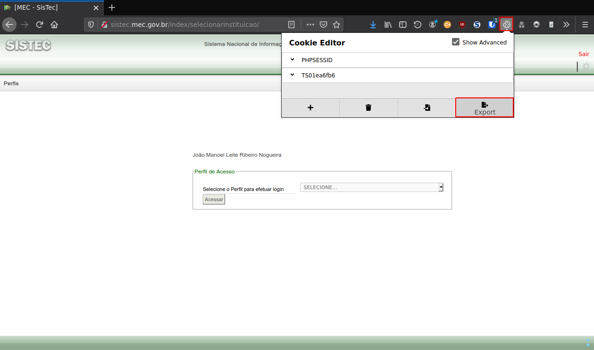

# sistec-download

Baixa as planilhas do SISTEC automaticamente para fins de cruzamento de dados com o Q-Acadêmico

1. [Instalação](#instalação)
2. [Crie uma pasta](#crie-uma-pasta)
3. [Fazendo o login](#fazendo-o-login)
    1. [Acessando o site do SISTEC](#acessando-o-site-do-sistec)
    2. [Gerando sistec.html com Firefox](#gerando-sistechtml-com-firefox)
    3. [Gerando sistec.html com Chrome](#gerando-sistechtml-com-chrome)
    4. [Gerando cookies.json com Firefox](#gerando-cookiesjson-com-firefox)
    5. [Gerando cookies.json com Chrome](#gerando-cookiesjson-com-chrome)
    6. [Upload dos arquivos](#upload-dos-arquivos)
4. [Escolhendo os campi](#escolhendo-os-campi)
5. [Efetuando o download](#efetuando-o-download)
6. [Logs do sistema](#logs-do-sistema)
    1. [Logs do andamento do download](#logs-do-andamento-do-download)
    2. [Logs de acesso do sistema](#logs-de-acesso-do-sistema)
    3. [Logs de erro do sistema](#logs-de-erro-do-sistema)
7. [Erro comum](#erro-comum)
    1. [Arquivo sistec_download.log](#arquivo-sistec_downloadlog)
    2. [Arquivo _turmas.json](#arquivo-_turmasjson)

## Instalação

Para a instalação tanto do lado do servidor (back-end), como do lado do cliente (front-end), leia [INSTALL.md](INSTALL.md)

## Crie uma pasta

Crie uma pasta de fácil acesso para você salvar os arquivos de login, eu no meu Ubuntu Mate 20.04.2 LTS,
escolhi a seguinte pasta:

``~/tmp``

criada com o seguinte comando:

```sh
$ mkdir -p ~/tmp
```

Nesta pasta colocarei os seguintes arquivos temporários usados para o login:

- ``~/tmp/sistec.html``
- ``~/tmp/cookies.json``

## Fazendo o login

### Acessando o site do SISTEC

Acesse o site do [SISTEC](https://sistec.mec.gov.br/) e faça o login normalmente, até chegar numa janela como essa:


### Gerando sistec.html com Firefox

Pressione as teclas CTRL+U e aparecerá o código fonte da página:


Pressione as teclas CTRL+A e selecione o código fonte da página:


Copie com CTRL+C e cole com CTRL+V dentro de um arquivo vazio no seu editor de texto favorito
(ex: Gedit, Pluma, Vim, Emacs, etc ...), no meu caso eu uso Vim:


Salve o arquivo como: `~/tmp/sistec.html` (de acordo com o [exemplo acima](#crie-uma-pasta))

### Gerando sistec.html com Chrome

Pressione a tecla `<F12>` e, depois clique na sequência em [1], [2], [3] e [4] conforme a imagem seguir:


Agora, copie o elemento html (tag select) conforme a imagem a seguir:


Cole com CTRL+V dentro de um arquivo vazio no seu editor de texto favorito
(ex: Gedit, Pluma, Vim, Emacs, etc ...), no meu caso eu uso Vim:


Salve o arquivo como: `~/tmp/sistec.html` (de acordo com o [exemplo acima](#crie-uma-pasta))

### Gerando cookies.json com Firefox

Exporte os cookies para a área de transferência:



Cole com CTRL+V dentro de um arquivo vazio no seu editor de texto favorito
(ex: Gedit, Pluma, Vim, Emacs, etc ...), no meu caso eu uso Vim:


Salve o arquivo como: `~/tmp/cookies.json` (de acordo com o [exemplo acima](#crie-uma-pasta))

### Gerando cookies.json com Chrome

Exporte os cookies para a área de transferência:


Cole com CTRL+V dentro de um arquivo vazio no seu editor de texto favorito
(ex: Gedit, Pluma, Vim, Emacs, etc ...), no meu caso eu uso Vim:


Salve o arquivo como: `~/tmp/cookies.json` (de acordo com o [exemplo acima](#crie-uma-pasta))

### Upload dos arquivos

**OBS: Lembrando que o endereço IPv4 e a porta (para desenvolvimento) do SISTEC-DOWNLOAD na minha rede doméstica é 192.168.100.7:8080**  
**Portanto, na sua rede, muito provavelmente vai ser diferente disso, aí considere o IP e a porta na sua rede.**

Abra a janela de login do [SISTEC-DOWNLOAD](http://192.168.100.7:8080/login):

[](http://192.168.100.7:8080/login)

Faça o upload dos arquivos salvos na pasta [tmp](#crie-uma-pasta):


## Escolhendo os campi

**Não se esqueça de habilitar o javascript para executar corretamente a página de downloads**  

Você deve escolher pelo menos um tipo de planilha (Presencial/EaD/FIC), para tanto marque uma ou mais das opções abaixo:


Dentro de cada uma das opções acima (Presencial/EaD/FIC), se selecionada, selecione também ao menos um Câmpus referente a opção marcada.  
Também note que não é permitido escolher mais de um perfil para um mesmo Câmpus (por ex: Câmpus Formosa).  

## Efetuando o download

Por fim, clique no botão "Download" conforme a seguir:


**OBS: É comum demorar muito tempo para baixar as planilhas selecionadas (se forem muitas).**  
**Por exemplo: aqui no IFG, para baixar todas as planilhas de todos os cursos Presenciais e EaD leva um pouco mais de uma hora.**  

## Logs do sistema

### Logs do andamento do download

```sh
$ cd /srv/www/sistec_download/log
$ ../bin/view-log.sh sistec_download_2021-03-12.log
```

**OBS: os arquivos de log do sistema são gerados por dia, como no exemplo acima (2021-03-12 = 12/03/2021)**

### Logs de acesso do sistema

```sh
$ cat /var/log/apache2/access.log
```

### Logs de erro do sistema

```sh
$ cat /var/log/apache2/error.log
```

## Erro comum

**Um erro muito comum, é quando extrapola o tempo de resposta de uma requisição feita ao servidor sistec.mec.gov.br (erro de timeout)**  
**Para contornar esse tipo de erro, refaça o download a partir da planilha que deu erro, esta recomendação serve**  
**inclusive para qualquer tipo de erro ao tentar fazer o download de quaisquer planilhas (câmpus).**  
**Nesse tipo de erro, teremos o seguinte:**  

### Arquivo sistec_download.log


**OBS: note que o arquivo acima é na verdade com o nome tipo: sistec_download_YYYY-MM-DD.log**  
**aonde: YYYY=ano, MM=mês, DD=dia**  
**Note que a última linha do log acima evidencia que o sistema ficou "travado" na lista de ciclos 1/# do Câmpus Goiânia.**  
**Ou seja, o sistema não conseguiu receber dentro do timeout do servidor do [SISTEC](https://sistec.mec.gov.br) a lista de ciclos do Câmpus Goiânia.**  
**Note também que esse arquivo fica na pasta "log" do sistema.**

### Arquivo _turmas.json


**OBS: este arquivo é útil para ver a última lista de ciclos do câmpus que está sendo baixada, dá para ver onde o sistema "parou",**  
**ou dá para perceber que erro aconteceu na última lista de ciclos baixada, no exemplo acima dá para perceber que ocorreu um erro de sistema**  
**no servidor do [SISTEC](https://sistec.mec.gov.br), muito provavelmente por timeout se considerarmos o arquivo de log do sistema logo acima.**  
**Note também que esse arquivo fica na pasta "app" do sistema.**
