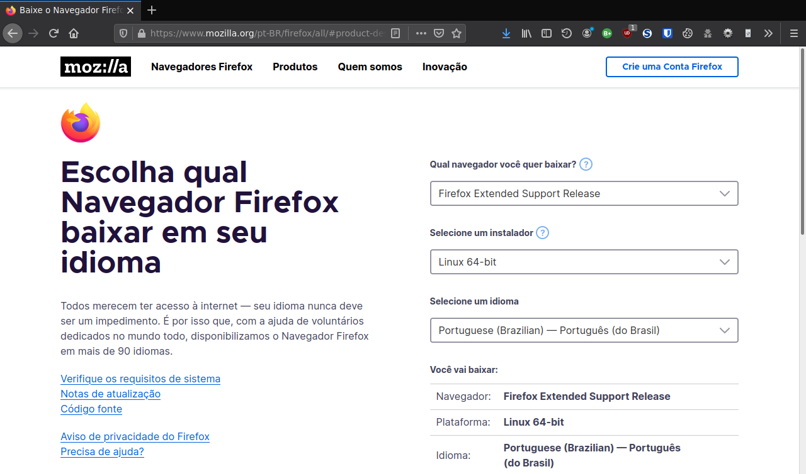
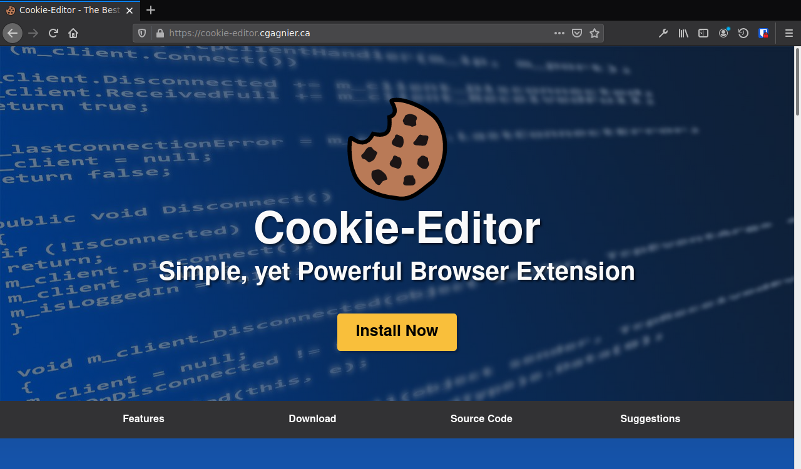

1. [Instalação Back-End](#instalação-back-end)
    1. [Baixe e instale o Debian GNU/Linux Bullseye](#baixe-e-instale-o-debian-gnulinux-bullseye)
    2. [Atualizando o servidor](#atualizando-o-servidor)
    3. [Configurando o locale](#configurando-o-locale)
    4. [Instalando o git](#instalando-o-git)
    5. [Baixando o sistec_download](#baixando-o-sistec_download)
    6. [Instalando o Python3.8](#instalando-o-python38)
    7. [Configurando o Virtualenv](#configurando-o-virtualenv)
    8. [Instalando o Apache2](#instalando-o-apache2)
    9. [Instalando o mod_wsgi](#instalando-o-mod_wsgi)
    10. [Configurando o Apache2](#configurando-o-apache2)
    11. [Ajustando o código fonte](#ajustando-o-código-fonte)
        1. [Ajustando sistec_download.py](#ajustando-sistec_downloadpy)
        2. [Ajustando sistec_lib.py](#ajustando-sistec_libpy)
    12. [Configurando as variáveis de ambiente](#configurando-as-variáveis-de-ambiente)
    13. [Configurando os Logs](#configurando-os-logs)
2. [Instalação Front-End](#instalação-front-end)
    1. [Navegador Web](#instale-o-navegador-web)
        1. [Instalar Mozilla Firefox](#instalar-mozilla-firefox)
        2. [Instalar Google Chrome](#instalar-google-chrome)
    2. [Cookie-Editor](#instalando-a-extensão-cookie-editor)

## Instalação Back-End

### Baixe e instale o Debian GNU/Linux Bullseye

- Para baixar no diretório corrente:
```sh
curl -L -O http://sft.if.usp.br/debian-cd/11.3.0/amd64/iso-cd/debian-edu-11.3.0-amd64-netinst.iso
```

- Guia de Instalação acessado a partir do navegador firefox:

```sh
firefox https://www.debian.org/releases/bullseye/amd64/index.pt.html
```

### Atualizando o servidor

```sh
sudo apt clean
sudo apt update
sudo apt upgrade
```

### Configurando o locale

```sh
sudo apt install locales
sudo sed -i 's|# pt_BR.UTF-8 UTF-8|pt_BR.UTF-8 UTF-8|' /etc/locale.gen
sudo sed -i 's|# en_US.UTF-8 UTF-8|en_US.UTF-8 UTF-8|' /etc/locale.gen
sudo locale-gen
sudo update-locale LANG="pt_BR.UTF-8" LANGUAGE="pt_BR:en_US"
```

### Instalando o git

```sh
sudo apt install git
```

### Baixando o sistec_download

```sh
sudo mkdir -p /srv/www
sudo chown www-data.www-data -R /srv/www
sudo chmod g+w -R /srv/www
sudo usermod -a -G www-data SEU_USUARIO
cd /srv/www
git clone https://github.com/jmanoel7/sistec_download.git
cd sistec_download
```
**OBS:** logo acima, onde consta SEU_USUARIO, ponha o seu usuário do sistema Debian (que não é o root)

### Instalando o Python3.9

```sh
sudo apt install python3.9 python3-pip python3-setuptools python3-wheel virtualenv
```

### Configurando o Virtualenv

- Em Desenvolvimento (com jupyterlab):
```sh
/srv/www/sistec_download/bin/mkvenv_sistec_download_dev.sh
```

- Em produção (sem o jupyterlab):
```sh
/srv/www/sistec_download/bin/mkvenv_sistec_download_prod.sh
```

### Instalando o Apache2

```sh
sudo apt install apache2
```

### Instalando o mod_wsgi

```sh
sudo apt install libapache2-mod-wsgi-py3
```

### Configurando o Apache2

Tanto em:

``/srv/www/sistec_download/config/apache2.conf``

como em:

``/srv/www/sistec_download/config/sistec_download.conf``

altere a seguinte linha:

> ServerName aguia:8080

para o IP ou hostname de acordo com a sua instituição:

> ServerName ifX.edu.br:80

Depois, altere nos dois aquivos também, a seguinte linha:

> ServerAdmin joao.nogueira@ifg.edu.br

para o admin do sistec_download da sua instituição:

> ServerAdmin fulano.beltrano@ifX.edu.br

Agora execute esses comandos:

```sh
sudo mv /etc/hosts /etc/hosts.bak
sudo cp hosts /etc/hosts
sudo cp *.pem /etc/ssl/certs/
sudo mv /etc/apache2/apache2.conf /etc/apache2/apache2.conf.bak
sudo cp /srv/www/sistec_download/config/apache2.conf /etc/apache2/apache2.conf
sudo mv /etc/apache2/envvars /etc/apache2/envvars.bak
sudo cp /srv/www/sistec_download/config/envvars /etc/apache2/envvars
sudo mv /etc/apache2/ports.conf /etc/apache2/ports.conf.bak
sudo cp /srv/www/sistec_download/config/ports.conf /etc/apache2/ports.conf
sudo cp /srv/www/sistec_download/config/sistec_download.conf /etc/apache2/sites-available/sistec_download.conf
sudo a2enmod wsgi
sudo a2ensite sistec_download.conf
sudo a2dissite 000-default.conf
sudo systemctl restart apache2.service
```

### Ajustando o Código Fonte

#### Ajustando sistec_download.py

``/srv/www/sistec_download/app/sistec_download.py``

Altere as seguintes linhas de código de acordo com a sua instituição:

```python
# AJUSTES PARA O IFG: INICIO
if campus == u'CÂMPUS ÁGUAS LINDAS DE GOIÁS'.encode('utf-8'):
   campus = u'CÂMPUS ÁGUAS LINDAS'.encode('utf-8')
if campus == u'CÂMPUS VALPARAÍSO DE GOIÁS'.encode('utf-8'):
   campus = u'CÂMPUS VALPARAÍSO'.encode('utf-8')
# AJUSTES PARA O IFG: FIM
```
Neste trecho de código fonte acima, nós abreviamos os nomes dos Câmpus Valparaíso e Águas Lindas,
retirando a parte final "de Goiás", porque internamente nos cruzamentos de dados que realizamos do
SISTEC com o Q-Acadêmico, não utilizamos o nome completo desses dois Câmpus. Aí cada um tem que ver
como usar na sua própria instituição, fazendo os ajustes dos nomes de Câmpus como deve ser feito,
caso a caso.

#### Ajustando sistec_lib.py

``/srv/www/sistec_download/app/sistec_lib.py``

Altere as seguintes linhas de código de acordo com a sua instituição:

```python
if match_fic:
    if not tipo_fic:
        continue
elif match_mm:
    if not tipo_fic:
        continue
elif match_ead:
    co_cursos = [338565, 338569, 338571, 338572, 338573, 338574, 338575,
        338578, 338580, 338581, 338582, 338583, 362343, 362344, 362345, 362346, 362347]
    if (tipo_presencial and int(co_curso) in co_cursos) or (tipo_ead and int(co_curso) not in co_cursos):
        pass
    else:
        continue
elif match_presencial:
    if not tipo_presencial:
        continue
else:
    continue
```

Neste trecho de código fonte acima, nós tratamos códigos de cursos à distância como se fossem presenciais,
aí na sua instituição você deve ver como tratar os seus cursos, presenciais, EaD e FIC. Cada instituição deve
ter uma forma própria de lidar com isso.

### Configurando as variáveis de ambiente

**ATENÇÃO: se você modificar algumas dessas variáveis, terá que modificar o respectivo arquivo de configuração ou código fonte**  

Os arquivos que contém as variáveis de ambiente são os seguintes:  

- ``/srv/www/sistec_download/config/sistec_download.env``  
    *usado para executar o sistec_download em modo de desenvolvimento*  

- ``/srv/www/sistec_download/app/sistec_download.wsgi``  
    *usado para executar o sistec_download em modo de produção*  

As variáveis de ambiente e seus valores padrão são os seguintes:  

- ``SISTEC_DOWNLOAD_CONFIG="/srv/www/sistec_download/config"``  
    *onde ficam os arquivos de configuração do sistema*  

- ``SISTEC_DOWNLOAD_APP="/srv/www/sistec_download/app"``  
    *onde ficam os arquivos de execução do sistema*  

- ``SISTEC_DOWNLOAD_PLANILHAS_PRESENCIAL="/srv/www/sistec_q/SISTEC-PARA-IMPORTACAO"``  
    *onde ficam as planilhas baixadas de cursos presenciais*  

- ``SISTEC_DOWNLOAD_PLANILHAS_EAD="/srv/www/sistec_ead/SISTEC-PARA-IMPORTACAO"``  
    *onde ficam as planilhas baixadas de cursos EaD*  

- ``SISTEC_DOWNLOAD_PLANILHAS_FIC="/srv/www/sistec_fic/SISTEC-PARA-IMPORTACAO"``  
    *onde ficam as planilhas baixadas de cursos FIC*  

- ``SISTEC_DOWNLOAD_COOKIES="/srv/www/sistec_download/upload"``  
    *onde ficam os arquivos de upload do sistema usados para efetuar o login no site do [SISTEC](https://sistec.mec.gov.br/)*  

- ``SISTEC_DOWNLOAD_LOG="/srv/www/sistec_download/log"``  
    *onde ficam os arquivos de log do sistema*  

### Configurando os Logs

Para configurar os logs do sistema se utiliza de uma variável global no arquivo `sistec_download.py`:  

``level_debug = [True, False, False]``  

Como pode-se observar é uma lista de três objetos do tipo booleano (True/False), existem três opções de logs no sistema,  
uma independe da outra (pode-se marcar somente o nível 3 por exemplo):  

- o primeiro nível é para listar o andamento do download ao longo do tempo, tipo quantas páginas de ciclos tem em um Câmpus,  
em qual página de ciclo está no momento, qual o ciclo está sendo baixado no momento, etc...

- o segundo nível é para mostrar detalhes de cada ciclo, detalhes de cada aluno que está sendo baixado, etc ...  

- o terceiro nível é para ver o detalhe de cada requisição feita pelo módulo pycurl e fica em outro arquivo de log.

**OBS: os dois primeiros níveis de log ficam gravados na pasta log do sistema, no arquivo:**  
**sistec_download_YYYY-MM-DD.log: YYYY=ano, MM=mês, DD=dia**  
**Já o terceiro nível de log fica gravado também na pasta log do sistema, porém em outro arquivo:**  
**pycurl_debug_YYYY-MM-DD.log: YYYY=ano, MM=mês, DD=dia**  

**ATENÇAO: o sistema vem com apenas o primeiro nível de log ativo, recomendamos isso para o sistema em produção.**  
**Mas, para situações de depuração do sistema em desenvolvimento, pode-se marcar o segundo/terceiro nível,**  
**porém tenha o cuidado de ao fazer depuração com o nível 2 ou 3 habilitados, escolha somente um Câmpus para o download,**  
**visto que se escolher todos os campi de uma instituição como o IFG (que tem 14 Câmpus), gera arquivos de logs de**  
**mais de 100 MB**  

## Instalação Front-End

### Instale o Navegador Web

Os navegadores Google Chrome e Mozilla Firefox funcionam perfeitamente com o sistec-download.  
A seguir, escolha um dos dois de acordo com a sua preferência.  

#### Instalar Mozilla Firefox

[](https://www.mozilla.org/pt-BR/firefox/all/#product-desktop-release)

#### Instalar Google Chrome

[](https://www.google.com/intl/pt-BR/chrome/)

### Instalando a Extensão Cookie-Editor

Adicione ao navegador web de sua preferência ([Google Chrome](https://chrome.google.com/webstore/detail/cookie-editor/hlkenndednhfkekhgcdicdfddnkalmdm) / [Mozilla Firefox](https://addons.mozilla.org/addon/cookie-editor?src=external-cookie-editor.cgagnier.ca)) a seguinte extensão:

[](https://cookie-editor.cgagnier.ca/#download)
